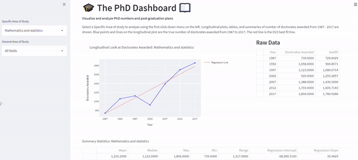

# Dashboards in Python  

The National Science Foundation collects and houses various information on doctoral degree recipients. This data includes numbers of degrees awarded, degree types, education history, and post-graduate plans. The repository of the data can be found [here](https://ncses.nsf.gov/pubs/nsf19301/data).  

The aim of this project is to extract, aggregate, visualize, and analyze this data in a dashboard. Python has various extensions and libraries that facilitate the creation of dashboards. This project uses [streamlit](https://streamlit.io/) to create the dashboard in python.   


Click on the streamlit badge below or [here](https://share.streamlit.io/delashu/pysolve_notebooks/main/dashboard/phd_dash.py) to open the dashboard.  

[](https://share.streamlit.io/delashu/pysolve_notebooks/main/dashboard/phd_dash.py)  
  

**Note for developers**:  
The following dashboard should be run on your own machine using an IDE such as [VSCode](https://code.visualstudio.com/). I highly recommend and encourage the use of a [virtual environment](https://code.visualstudio.com/docs/python/environments) to set-up dashboards.  
The py file that contains the code to build the streamlit dashboard is found [here](https://github.com/delashu/pysolve_notebooks/blob/main/dashboard/phd_dash.py).  
The code can be downloaded onto any machine.  
To run the app, make sure to name your py file, *phd_dash.py* and run the below line in your terminal within your virtual environment:  
```
streamlit run phd_dash.py
```


### Dashboard Features Part I   
The NSF has collected the number of doctoral degrees awarded from 1987 - 2017. The dashboard visualizes this longitudinal trend with a line plot.  
The user can interact with the first click-down menu item called, "Specific Area of Study" to select a specific major of interest. 

This portion of the dashboard has three main parts:  
1. Plot and corresponding regression line  
2. Raw data 
3. Summary Statistics  
  
The plot includes the number of doctoral recipients and the best fit OLS regression line.  
The table on the right provides the raw data used to create the plot.  
The table at the bottom outputs summary statistics of the plot such as the mean, median, max, min, range, OLS regression intercept, and OLS regression slope.   

The dashboard provides a blurb on the data and its capabilities:  
```
Select a Specific Area of study to analyze using the first click-down menu on the left. 
Longitudinal plots, tables, and summaries of number of doctorates awarded from 1987 - 2017 are shown.
 Blue points and lines on the longitudinal plot are the true number of doctorates awarded from 1987 to 2017. 
 The red line is the OLS best fit line.
```


The first gif shows the user selecting, "Mathematics and Statistics".  
Once selected, all elements of the dashboard change accordingly. The default is set to, "All fields".      
   


The elements of the dashboard can be expanded. The gif below shows the user getting a better look at the line plot and raw data.   

   

Below is a print-out of the summary table found at the bottom of the page.  Interestingly, there is a precipitous drop in PhD graduates in "Mathematics and Statistics" in 2002 with only 739. Conversely 1,856 doctoral degrees in "Mathematics and Statistics" were awarded in 2017.    

| Mean        | Median            | Max | Min | Range        | Regression Intercept            | Regression Slope |
|:-------------|:------------------|:-------------|:---------------|:-------------|:------------------|:-------------|
| 1,255.29 |  1,123   | 1,856         | 739           |1,117 |  -68,900.51   | 35.04         |


### Dashboard Features Part II   
The second portion of the dashboard provides visualizations and analytics of post-graduate plans and landing locations of PhD graduates in 2017.  
This portion of the dashboard has three main parts:  
1. Barplot of post-grad plans    
2. Barplot of landing locations in the US     
3. Sector breakdown (summary statistics) of those decided to pursue employment      


Two barplots and one table are shown. The left barplot visualizes the post-graduate plans for PhD graduates. Each bar represents the number of graduates who plan to continue study ("PostGrad Study"), have found a job ("Employment"), are looking for the next opportunity ("Seeking"), and "Other".  
The right barplot shows the landing locations for PhD graduates for those who plan to remain in the US. Note that this barplot represents a percentage of the PhD graduates who will reside in "New England", "Middle Atlantic", "East North Central", "West North Central", "South Atlantic", "East South Central", "West South Central", "Mountain", or "Pacific/Insular" regions.  

The bottom table shows the percentage breakdown of Primary Activity of Employment among those graduates who pursued employment.  
Primary Activity can be categorized as "R&D", "Teaching", "Management or Administration", "Professional services", or "Other". 


The dashboard provides the below blurb on the post-grad plan data and how to interact with the dashboard:    
```
Select a General Area of study to analyze using the second click-down menu on the left.
 Two barplots are rendered based on your input that shows post-graduate plans and 
 landing locations for the year of 2017.
```

The user can select a "General Area of Study" using the second drop-down menu to visualize post-grad plans by a general area of study.  
The gif below shows the user selecting, "Mathematics and computer science".  
Once selected, all elements of the dashboard change accordingly.   

  

The elements of the dashboard are all interactive. The gif below shows the user scrolling through the bars and expanding the table.   
  

Below is a print out of the table at the bottom of the dashboard:   
  
| R&D        | Teaching            | Management or Administration | Professional Services | Other        |
|:-------------|:------------------|:-------------|:---------------|:-------------|
| 41.6 |  32.9   | 10.4         | 10.4           |5.1 |  
  

Not surprisingly, the majority of "Mathematics and computer science" PhD graduates who find a job enter the R&D sector. Also unsurprisingly as shown in the right box plot, most "Mathematics and computer science" PhD graduates land in the "Pacific/Insular" region.  