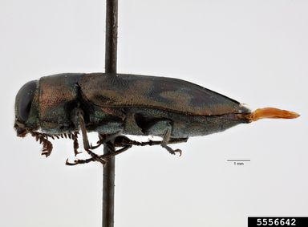
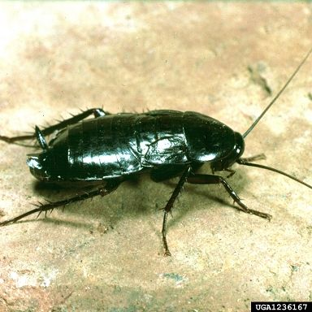
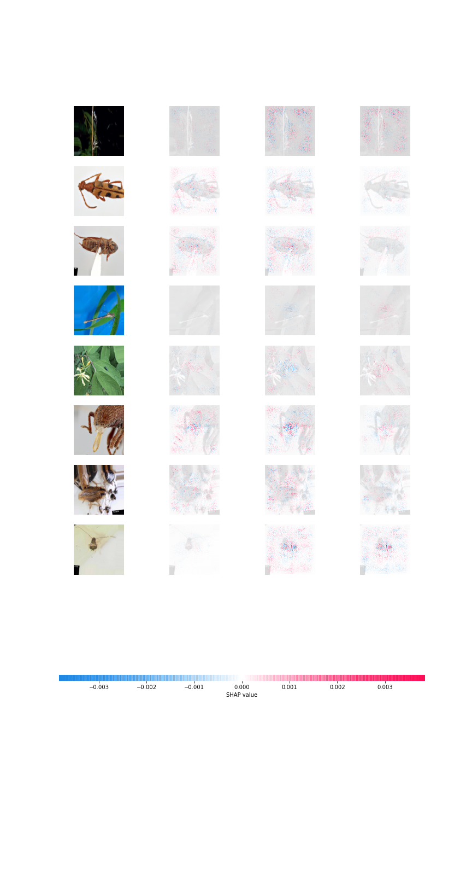

# Deep Learning Bug Classification  
  
The objectives of this project are two fold:   
1. Build a deep learning model that accurately classifies a set of images of bugs as *Dragonflies*, *Cockroaches*, or *Beetles*.   
2. Explain predictions made by the model using [SHapley Additive exPlanations](https://github.com/slundberg/shap).   

Computing is done in  Python 3.7.8. I use tensorflow and keras to create the deep learning model.  
The jupyter notebook used to create the model and output the SHAP values is found [here](https://github.com/delashu/pysolve_notebooks/blob/main/deep_learning/NN.py).   

### BUGS! 
The training image set can be found [here](https://www.dropbox.com/s/fn73sj2e6c9rhf6/insects.zip?dl=0&file_subpath=%2Finsects%2Ftrain). The test image set can be found [here](https://www.dropbox.com/s/fn73sj2e6c9rhf6/insects.zip?dl=0&file_subpath=%2Finsects%2Ftest).   

Below are examples images of the three categories of bugs the model attempts to classify. From left to right, the images show a beetle, a cockroach, and a dragonfly.    
<p float="left">
  
   
  
</p>  

## Objective 1   
  

**Objective 1** is met by creating the deep learning model.  
Before diving into the python code, download the images to your local directory using the following bash commands:  
```bash  
wget https://people.duke.edu/~ccc14/insects.zip
unzip insects.zip
ls -R insects
```

Below are the libraries used:   
```python
import matplotlib.pyplot as plt
import pathlib
import numpy as np
import pandas as pd
from sklearn.model_selection import train_test_split
import random
import os
from tensorflow.keras.preprocessing.image import ImageDataGenerator,load_img
from tensorflow.keras.callbacks import EarlyStopping, ReduceLROnPlateau
from tensorflow.keras.utils import to_categorical
from tensorflow.keras.models import Sequential
from tensorflow.keras.layers import Conv2D,MaxPooling2D,Dropout,Flatten,Dense,Activation,BatchNormalization
```

I create lists for the the full paths to each training image and each training image label:  
```python 
#create a list of training files with full file paths
training_files = []
#create a list of the labels of these training files
training_labels = []
for file_path in pathlib.Path("insects/train/beetles/").glob('**/*'):
    training_files.append(str(file_path.absolute()))
    training_labels.append("beetles")
for file_path in pathlib.Path("insects/train/cockroach/").glob('**/*'):
    training_files.append(str(file_path.absolute()))
    training_labels.append("cockroach")
for file_path in pathlib.Path("insects/train/dragonflies/").glob('**/*'):
    training_files.append(str(file_path.absolute()))
    training_labels.append("dragonflies")  
```  

The same operations are performed on the test files and test labels:   
```python 
#create a list of test files with full file paths    
test_files = []
#create a list of the labels of the test files
test_labels = []
for file_path in pathlib.Path("insects/test/beetles/").glob('**/*'):
    test_files.append(str(file_path.absolute()))
    test_labels.append("beetles")
for file_path in pathlib.Path("insects/test/cockroach/").glob('**/*'):
    test_files.append(str(file_path.absolute()))
    test_labels.append("cockroach")
for file_path in pathlib.Path("insects/test/dragonflies/").glob('**/*'):
    test_files.append(str(file_path.absolute()))
    test_labels.append("dragonflies")
``` 

Create a dataframe using the above lists to house the file paths and their respective classes. The labels are re-coded using one-hot encoding where beetle is 0, cockroach is 1, and dragonfly is 2.     

```python 
#create training dataframe
train_df = pd.DataFrame({
    'file':training_files,
    'label':training_labels
})
#create test dataframe
test_df = pd.DataFrame({
    'file':test_files,
    'label':test_labels
})
#change labels via one-hot encoding
train_df["label"] = train_df["label"].replace({0:'beetle',1:'cockroach',2:'dragonflies'})
test_df["label"] = test_df["label"].replace({0:'beetle',1:'cockroach',2:'dragonflies'})
num_classes = len(test_df["label"].unique())
```

Let's now define the properties of the images we are reading and predicting. We set a batch size of eight, which is somewhat arbitrary, but provides a number not too high or low given the number of training observations:  

```python 
#Define the image properties
width = 128
height = 128
img_sz = (width,height)
channels = 3
mybatch = 8
```

[An Image Data Generator](https://www.tensorflow.org/api_docs/python/tf/keras/preprocessing/image/ImageDataGenerator) is used to generate batches of the bug images with augmentation. We first perform the data augmentation generator on the training data.     
```python 
#data generation for the training images
train_idg = ImageDataGenerator(rotation_range = 15,
                        rescale = 1./255,
                        shear_range = 0.1,
                        zoom_range = 0.2,
                        horizontal_flip = True,
                        width_shift_range = 0.1,
                        height_shift_range = 0.1
                                )

train_flow = train_idg.flow_from_dataframe(train_df,
                        x_col = 'file',
                        y_col = 'label',
                        target_size = img_sz,
                        class_mode = 'categorical',
                        batch_size = mybatch)
```
The above provides the below output that validates the augmentation process:  
```bash 
Found 1019 validated image filenames belonging to 3 classes.
```  

The training data can now be further split into validation and training data.   
```python 
#we've created a training set. From the training set, subset 15% as validation
#set the seed as 1125
training_df, validation_df = train_test_split(train_df, test_size=0.15, random_state = 1125)
training_df = training_df.reset_index(drop=True)
validation_df = validation_df.reset_index(drop=True)
```  

The validation set is then created  
```python 
#prepare validation set
validation_idg = ImageDataGenerator(rescale=1./255)
validation_flow = validation_idg.flow_from_dataframe(
    validation_df,x_col='file',y_col='label',
    target_size=img_sz, class_mode='categorical',
    batch_size=mybatch)
``` 
   
This results in the below output:  
```bash 
Found 153 validated image filenames belonging to 3 classes.
```   
   
The same procedure is run to prepare the test set:  
```python 
#prepare test set
test_idg = ImageDataGenerator(rotation_range=15,
                rescale=1./255,
                shear_range=0.1,
                zoom_range=0.2,
                horizontal_flip=True,
                width_shift_range=0.1,
                height_shift_range=0.1)

test_flow = test_idg.flow_from_dataframe(test_df,
                x_col='file',y_col='label',
                target_size=img_sz, class_mode='categorical',
                batch_size=mybatch)
```


Now that the training, validation, and test images are prepared for modeling, we can create the Neural Net Model Infrastructure.  
```python 
#Create NN Model:
NNmodel=Sequential()
NNmodel.add(Conv2D(32,(3,3),activation='relu',input_shape=(width, height, channels)))
NNmodel.add(BatchNormalization())
NNmodel.add(MaxPooling2D(pool_size=(2,2)))
NNmodel.add(Dropout(0.15))
NNmodel.add(Conv2D(64,(3,3),activation='relu'))
NNmodel.add(BatchNormalization())
NNmodel.add(MaxPooling2D(pool_size=(2,2)))
NNmodel.add(Dropout(0.25))
NNmodel.add(Conv2D(128,(3,3),activation='relu'))
NNmodel.add(BatchNormalization())
NNmodel.add(MaxPooling2D(pool_size=(2,2)))
NNmodel.add(Dropout(0.05))
NNmodel.add(Flatten())
NNmodel.add(Dense(512,activation='relu'))
NNmodel.add(BatchNormalization())
NNmodel.add(Dropout(0.5))
NNmodel.add(Dense(num_classes,activation='softmax'))
NNmodel.compile(loss='categorical_crossentropy',
  optimizer='rmsprop',metrics=['accuracy'])
```  

Let's print out the full model summary to see what is going on:  

```bash
Model: "sequential"
_________________________________________________________________
Layer (type)                 Output Shape              Param #   
=================================================================
conv2d (Conv2D)              (None, 126, 126, 32)      896       
_________________________________________________________________
batch_normalization (BatchNo (None, 126, 126, 32)      128       
_________________________________________________________________
max_pooling2d (MaxPooling2D) (None, 63, 63, 32)        0         
_________________________________________________________________
dropout (Dropout)            (None, 63, 63, 32)        0         
_________________________________________________________________
conv2d_1 (Conv2D)            (None, 61, 61, 64)        18496     
_________________________________________________________________
batch_normalization_1 (Batch (None, 61, 61, 64)        256       
_________________________________________________________________
max_pooling2d_1 (MaxPooling2 (None, 30, 30, 64)        0         
_________________________________________________________________
dropout_1 (Dropout)          (None, 30, 30, 64)        0         
_________________________________________________________________
conv2d_2 (Conv2D)            (None, 28, 28, 128)       73856     
_________________________________________________________________
batch_normalization_2 (Batch (None, 28, 28, 128)       512       
_________________________________________________________________
max_pooling2d_2 (MaxPooling2 (None, 14, 14, 128)       0         
_________________________________________________________________
dropout_2 (Dropout)          (None, 14, 14, 128)       0         
_________________________________________________________________
flatten (Flatten)            (None, 25088)             0         
_________________________________________________________________
dense (Dense)                (None, 512)               12845568  
_________________________________________________________________
batch_normalization_3 (Batch (None, 512)               2048      
_________________________________________________________________
dropout_3 (Dropout)          (None, 512)               0         
_________________________________________________________________
dense_1 (Dense)              (None, 3)                 1539      
=================================================================
Total params: 12,943,299
Trainable params: 12,941,827
Non-trainable params: 1,472
_________________________________________________________________
```
I've added four dropout layers - each with parameters of 0.15, 0.25, 0.005, and 0.5. I batch normalize the images and the model four times and set two dense layers.  


The model requires that we define an early stopping value and a learning rate reduction.  

```python 
#set early stopping
earlystop = EarlyStopping(patience = 10)
#set learning rate reduction
learning_rate_reduction = ReduceLROnPlateau(patience = 2,
                                            verbose = 1,
                                            factor = 0.5,
                                            min_lr = 0.00001)
callbacks = [earlystop, learning_rate_reduction]
```   


With the model parameters now set, I train the model using 10 epochs. I tried fitting the model on various epochs with the training data, but found that 10 consistently gave a strong accuracy without the model running for an excessively long time. Each model run took approximately 8 minutes to fit.        
```python 
#train the model:
from keras.callbacks import EarlyStopping, ModelCheckpoint
#set epochs 
epochs=10 
#number of validation images
total_validate = validation_df.shape[0]
#number of training images
total_train = train_df.shape[0]
#FIT THE MODEL!
history = NNmodel.fit(
    train_flow, 
    epochs=epochs,
    validation_data=validation_flow,
    validation_steps=total_validate//mybatch,
    steps_per_epoch=total_train//mybatch,
    callbacks=callbacks
)
```  

Epochs eight through ten provided the following output:  
```bash 
Epoch 8/10
127/127 [==============================] - 28s 218ms/step - loss: 0.4157 - accuracy: 0.8467 - val_loss: 0.1682 - val_accuracy: 0.9342
Epoch 9/10
127/127 [==============================] - 27s 215ms/step - loss: 0.3562 - accuracy: 0.8754 - val_loss: 0.1702 - val_accuracy: 0.9145
Epoch 10/10
127/127 [==============================] - 29s 230ms/step - loss: 0.3588 - accuracy: 0.8714 - val_loss: 0.1580 - val_accuracy: 0.9276
``` 
Note that the accuracy slowly increases and the loss is slowly decreasing as epochs increase. The model is learning!  

Now that the model is fit, we can diagnose its loss and accuracy.  
```python 
train_loss, train_accuracy = NNmodel.evaluate(train_flow)
train_loss, train_accuracy
```  
We get the resulting output:  
```bash 
128/128 [==============================] - 8s 63ms/step - loss: 0.1961 - accuracy: 0.9342
(0.1961207240819931, 0.9342492818832397)
```  

While it's great that we're getting such high training accuracy (**93.4%**), more importantly, we want to know how it performs on the test data.  
```python 
test_loss, test_accuracy = NNmodel.evaluate(test_flow)
test_loss, test_accuracy
```   
This outputs the following diagnostic values:  
```bash 
23/23 [==============================] - 1s 60ms/step - loss: 0.2850 - accuracy: 0.9167
(0.28495872020721436, 0.9166666865348816)
```
The test accuracy drops to **91.7%**. The model is still generalizable to new images, but loses a bit of accuracy, which may be a sign of slight overfitting to the training data.    


We can also visualize model performance by plotting the loss and accuracy by epochs (10). In general, as epochs increase, loss decreases and accuracy increases.  

  
  
## Objective 2  
The neural net model predictions on the test set can be explained by SHapley Additive exPlanations. 
Import the following libraries:  
```python 
import shap
import numpy as np
```
I utilize the gradient explainer on the test training dataset:  

```python 
explainer = shap.GradientExplainer(NNmodel, train_flow[0][0])
```

The explainer is then used to output the SHAP values.  

```python 
sv = explainer.shap_values(test_flow[0][0]);
```

The values are then plotted to visualize how the shapley values attributes certain parts of the image to classify the bugs:   
```python 
shap_img = shap.image_plot(sv, test_flow[0][0], show = False)
```
The below image is output:   


Draw inference from the plot.  