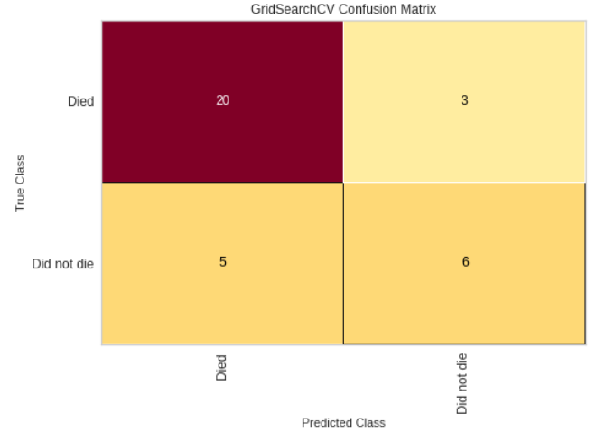
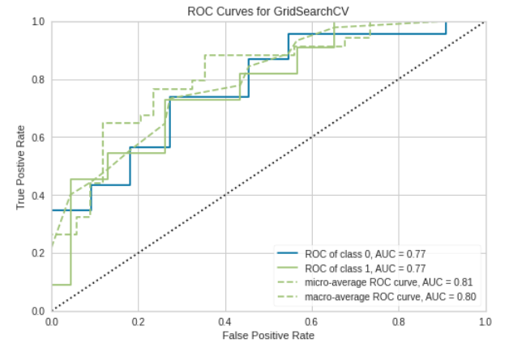
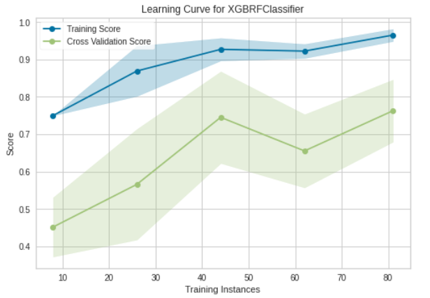
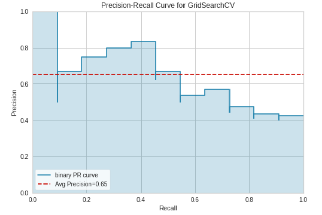
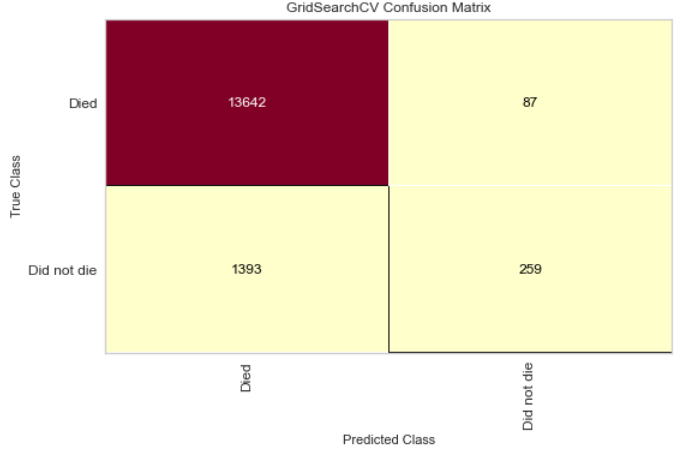
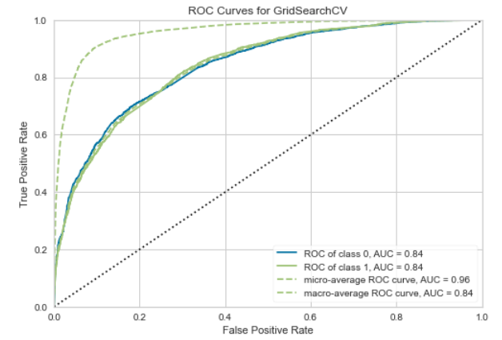
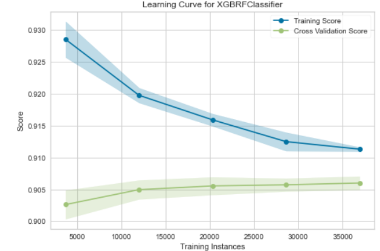
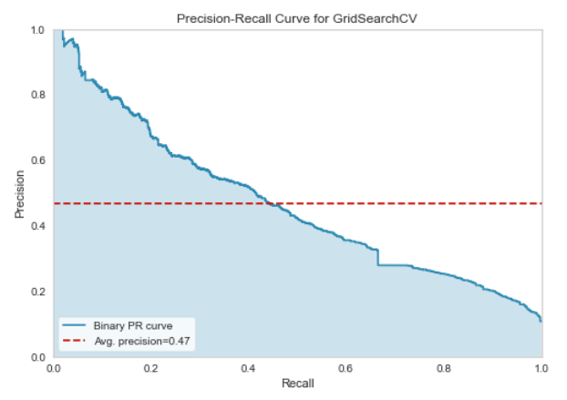

# Modeling ICU Deaths  
   
  
## Background & Motivation  
The Intensive Care Unit (ICU) is a specialized treament department within hospitals that provide critical medical care and life support to patients. Deaths in the ICU prove to be a problematic challenge that healthcare reserachers and professionals try preventing and forecasting ( [Zimmerman JE, et. al 2013](https://pubmed.ncbi.nlm.nih.gov/23622086/), [Young MP, et. al 2000](https://pubmed.ncbi.nlm.nih.gov/11151525/), [USF Health Policy Reserach](https://healthpolicy.ucsf.edu/icu-outcomes), [Braber A, et. al 2010](https://pubmed.ncbi.nlm.nih.gov/20386386/),  [Wu AW, et. al 2002](https://pubmed.ncbi.nlm.nih.gov/12096371/) ).   

This project aims to build upon previous literature to 1) *develop an algorithm* that accurately provides risk of death during an ICU visit, and 2) *deploys the algorithm* via a dashboard that outputs a probability of death risk score during an ICU stay based on user-input. This project uses the **Medical Information Mart for Intensive Care** ([MIMIC](https://mimic.mit.edu/)) as its data source for analysis and modeling.  
Workflow is organized into four parts: 1) Data Extraction, 2) Feature Engineering, 3) Model Development, 4) Model/Dashboard Deployment, and 5) Individual Contributions. The GitHub repository that hosues the codebase and workflow is found [here](https://github.com/delashu/BIOS823_Project).   

## Table of Contents
1. [Data Extraction](#de)
2. [Feature Engineering](#fe)
3. [Model Development](#md)
4. [Model/Dashboard Deployment](#dash)
5. [Individual Contributions](#contr)

## Data Extraction <a name="de"></a>     
All group members first requested permission to the full [MIMIC III](https://mimic.mit.edu/) dataset. We also downloaded and utilized the [demo data](https://physionet.org/content/mimiciii-demo/1.4/) as a proof-of-concept for the project pipeline.  
This analyses utilizes and integrates four datasets to model ICU deaths. These are:  
1. [ICU Stays](https://physionet.org/content/mimiciii-demo/1.4/ICUSTAYS.csv)   
Provides information regarding the ICU stay such as first ICU care unit, ward number, and length of stay during the ICU.  
2. [Admissions](https://physionet.org/content/mimiciii-demo/1.4/ADMISSIONS.csv)   
Provides insurance status, admit status, admission diagnosis, and death flag (used as outcome)  
3. [Prescriptions](https://physionet.org/content/mimiciii-demo/1.4/PRESCRIPTIONS.csv)  
Provides prescription type administered, prescription name, and prescription dosage. 
4. [Procedures](https://physionet.org/content/mimiciii-demo/1.4/PROCEDUREEVENTS_MV.csv)   
Provides procedural information for patients. Procedural groupings such as "Invasive Lines", "General Procedures", "Ventilation", and "Imaging" are used to make counts of procedures for each patient during their ICU stay.   

The below table shows the differences in data sizes between the demo data and the full data.   

| Table Name      | Demo Table      | Full Data      |
| ----------- | ----------- | ----------- |
| ICU Stays      | 13.2 KB       | 1.9MB       |
| Admissions   | 26.2 KB        | 2.4 MB       |
| Prescriptions      | 1.6 MB       | 98.7 MB       |
| Procedures   | 131.1 KB        | 7.5 MB       |
      
Due to the size differences between the demo table and the full data, we began our data downloading, pipeline building, exploratory analysis, and prelimiary model fitting on the demo data. We then utilized GoogleBigQuery, GoogleCloud, and SQL databases to download, store, and use the full data. This allowed the group to create pipelines with the demo data and then migrate the pipeline to the full data.  

## Feature Engineering <a name="fe"></a>        
The *ICU Stays* data table acts as the base dataframe for the model. Each row represents an ICU stay. The *Admissions*, *Prescriptions*, and *Procedures* data tables are then used to append to the ICU Stays data. Preliminary feature engineering scripts and code is found [here](https://github.com/delashu/BIOS823_Project/blob/main/scripts/feature_engineering/fe_01.ipynb).   

We first performed a literature review of factors associated with ICU death to define and select covariates for the model, as many researchers have attempted creating models for various ICU outcome prediction.    
Our review shows that [organ dysfunction, CV failures, and CV diseases](https://www.ncbi.nlm.nih.gov/pmc/articles/PMC1794454/) (Mayr VD, et al. 2006) are highly associated with ICU death. 

The Admissions table provides the following information used by the final model: *Admission Type* (EMERGENCY, ELECTIVE, etc.), *Admission Location* (EMERGENCY ROOM, TRANSFER FROM HOSP, CLINIC REFERRAL, etc.), *Insurance Type* (Meidcare, Medicaid, Private, Other), and *Diagnosis Type*.  Since the *Diagnosis Type* variable had too many categories, we grouped these variables into five buckets: Sepsis, Other, Organ Failure, CV Failure, CNS Failure.  

The *Prescriptions* demo table was used to create counts of specific presciptions for each unique subject and icu stay combination. The below code creates counts for each icu stay.   

```python 
mycounts = drugdf.groupby(['subject_id', 'icustay_id', 'formulary_drug_cd']).size().reset_index(name='counts')
mycounts_long = mycounts.pivot(index = ['subject_id','icustay_id'], 
                               columns = 'formulary_drug_cd', values = 'counts').reset_index()
```
The top twenty prescriptions seen in the demo data are used as a filtering criteria for prescriptions of interest (the list of top twenty prescriptions were derived and pickled for real-time modeling).  

In a similar fashion, the *Procedures* demo table was used to create counts of procedures attributed to each patient and each ICU stay.   
```python 
mycounts = drugdf.groupby(['subject_id', 'icustay_id', 'formulary_drug_cd']).size().reset_index(name='counts')
mycounts_long = mycounts.pivot(index = ['subject_id','icustay_id'], 
                               columns = 'formulary_drug_cd', values = 'counts').reset_index()
```
The top eight procedures are used in the model.  
The list of top eight from the demo data were first derived and pickled for later modeling use.  

The ICU Stays table, Admissions table, prescriptions counts per icu stay, and procedure count per icu stay were then merged together to create a final analytic dataset using the demo data.  

### Full Data Migration  
The next objective of the project was to migrate the following workflow to the **full** MIMIC dataset.  
In order to do this, first, the above feature engineering pipelines were functionized so that they could be run in a real-time environment on new data. The functionization code can be found in [this notebook](https://github.com/delashu/BIOS823_Project/blob/main/scripts/feature_engineering/fe_functions.ipynb). The inputs of the function are the four tables of interest. The output is the final analytic dataset.   
Second, we leveraged tools to house and query the full MIMIC database. Preliminary attempts were done in GoogleBigQuery and GoogleCloud. The group passed JSON authentication files and access keys. However, the VisioNet databases did not allow for all datasets to be queried correctly.  
The group ultimately decided to use sqlite to house the MIMIC datasets of interest. Each dataset was stored as a table in one sqlite database (db). Find the workflow and code for sql db creation [here](https://github.com/delashu/BIOS823_Project/blob/main/scripts/database_creation.ipynb). Once all tables were stored and a db was created, the feature engineering function was used to create the final analytic dataset.  

The group then performed EDA on the final analytic dataset via [pandas profiling](https://github.com/pandas-profiling/pandas-profiling). The jupyter notebook and resulting html file of the profiling can be found [here](https://github.com/delashu/BIOS823_Project/tree/main/scripts/EDA).    
  
## Model Development <a name="md"></a>      
We first perform model development on the demo data. Model development includes preparing the data for modeling, fitting dummy models, and comparing that dummy model on more sophisitcated models. The full workflow can be found in [the baseline modeling notebook](https://github.com/delashu/BIOS823_Project/blob/main/scripts/modeling/baseline_modeling.ipynb). We first show that in the demo data, 67% of the rows are non-deaths and 33% of the rows are deaths. Thus, the data is slightly imbalanced.  
We run the following classification models on the demo data:  
- DummyClassifier  
- LogisticRegression  
- DecisionTreeClassifier  
- KNeighborsClassifier  
- SVC  
- RandomForestClassifier  
- xgboost.XGBRFClassifier  
- catboost.CatBoostClassifier  

These result in the following evaluation metrics:  
```bash
DummyClassifier        AUC:0.497 STD: 0.15
LogisticRegression     AUC:0.700 STD: 0.22
DecisionTreeClassifier AUC:0.597 STD: 0.14
KNeighborsClassifier   AUC:0.640 STD: 0.21
SVC                    AUC:0.714 STD: 0.17
RandomForestClassifier AUC:0.762 STD: 0.14
XGBRFClassifier        AUC:0.738 STD: 0.15
CatBoostClassifier     AUC:0.749 STD: 0.20
```   
We then performed stacking on to further explore possible modeling avenues.  
The three best performing models were *Random Forest*, *XGBRF Classifier*, and the *Cat Boost Classifier*. All three models performed relatively the same.  
We chose the XGBoost Random Forest Classifier since we aimed to perform grid search to find optimal hyper parameters, the group's prior experience with the XGBRF, and its suspected higher performance on the test data.  
We computed a preliminary hyper-parameter grid search on the demo data to output baseline values for the grid search on the full MIMIC data. We then output more evaluation metrics on the XGBRFClassifier. Below are plots that show the Confusion Matrix, ROC Curves, Precision-Recall, and Learning Curve for the XGBRFClassifier.  


<p float="left">
  
   
</p>  
Confusion Matrix and ROC plot  
<p float="left">
  
   
</p>  

Learning Curve and Precision-Recall Curve   

The final training model on the demo data yielded a prediction accuracy of 76%  

### Model Migration to Full Data  
The model was then migrated to the full data. The notebook that performs the migration to the full MIMIC data is found [here](https://github.com/delashu/BIOS823_Project/blob/main/scripts/modeling/full_data_modeling.ipynb).  
The XGBRFClassifier (selected from the demo data) was fit on the full data. 
The classifier gave the following AUC and STD:  
```bash 
XGBRFClassifier        AUC:0.825 STD: 0.00
```

A grid search was then performed to find the optimal hyper-parameters of the XGBRFClassifier on the full MIMIC dataset. The hyper-parameter grid was selected based on initial hyper-parameters that were found in the demo data modeling step.  
The cross-validated grid search hyper-parameters are as follows:  
```python 
params = {
    'min_child_weight': [1, 5],
    'gamma': [1, 1.5],
    'colsample_bytree': [0.8, 1.0],
    'max_depth': [4, 7],
}  
```  

This grid search gave the final model hyper-parameters to be used on the test data.  
We then tested the model on the held-out test data. The following plots visualize the model performance.    
  

<p float="left">
  
   
</p>  
Confusion Matrix and ROC plot on the full MIMIC data   
<p float="left">
  
   
</p>  

Learning Curve and Precision-Recall Curve on the full MIMIC data   

The final model yielded a test accuracy of **90.4%**   


## Model & Dashboard Deployment <a name="dash"></a>       

The model trained on the full MIMIC dataset is now ready to be deployed as a data and predictive machine learning product. We chose to use streamlit to deploy a dashboard that allows users to perform exploratory data analyses and also make predictions using our final XGBRFClassifier.  
The first part of the streamlit application allows users to input a continuous and a categorical variable of interest from a drop-down menu. The dashboard reacts accordingly and outputs interactive plots of each variable stratifed by death status.  
The second part of the streamlit application allows users to input ICU stay information, where each user input is a covariate in the XGBRFClassifier. Based on the input covariates, the model will predict on the patient and give a probability of death score between 0 and 100.   
The score is then categorized into "Low" (<15), "Medium" (>=15 & <20), and "High" (>=20) probability of death. These cut-offs are chosen from the distribution of scores found in the final model on the test and training datasets.  

Consider for example the user is overseeing a patient in the ICU who has had a length of stay of 8 days, 2 administrations of insulin, had a *Emergency* admit type,  and has had 2 dialysis procedures.  
The user will then input these covariates in the dashboard. The dashboard will output a risk of death during the patient's ICU stay, and also a risk range of Low, Medium, or High.  

Click the badge, [](https://share.streamlit.io/delashu/bios823_project/main/scripts/dashboard/icu_dash.py), or use the hyperlink [here](https://share.streamlit.io/delashu/bios823_project/main/scripts/dashboard/icu_dash.py) to open the dashboard.     

  