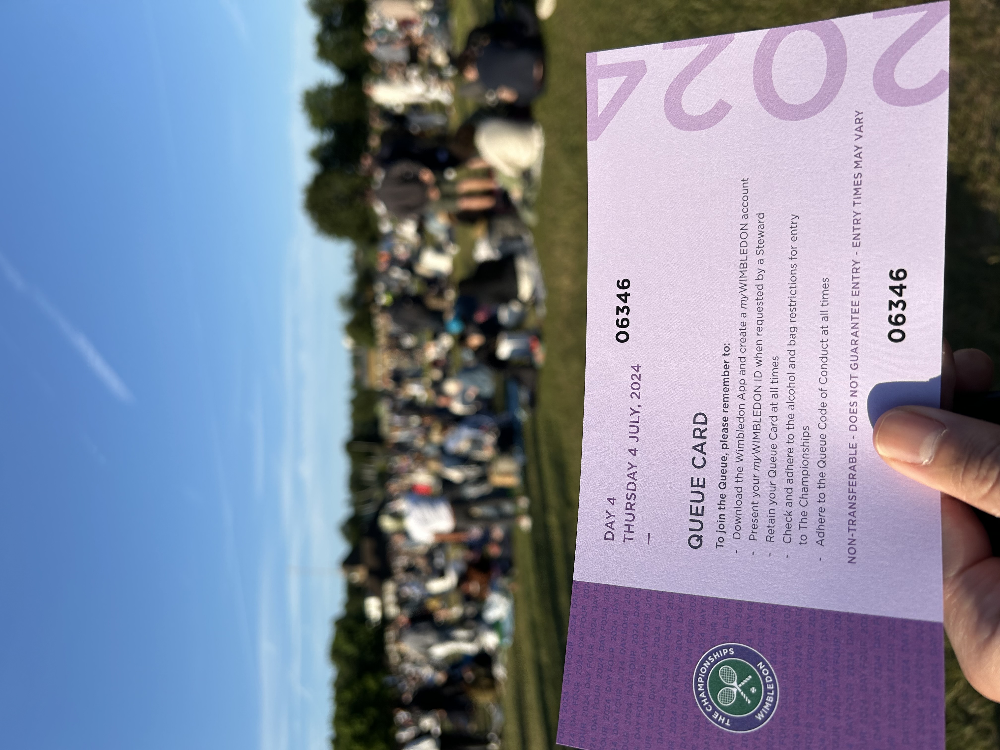
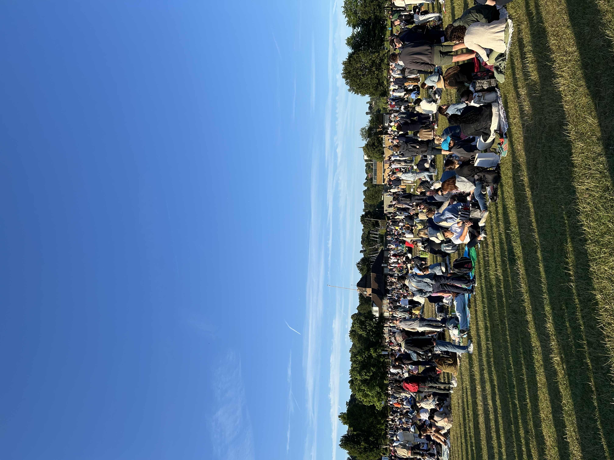
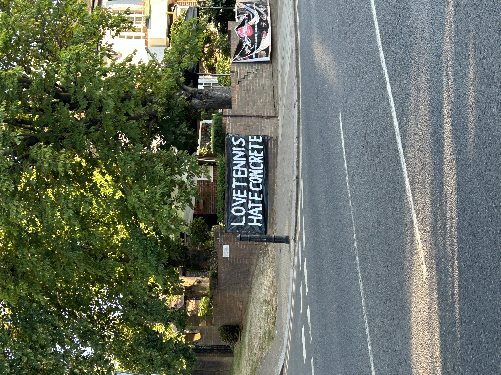
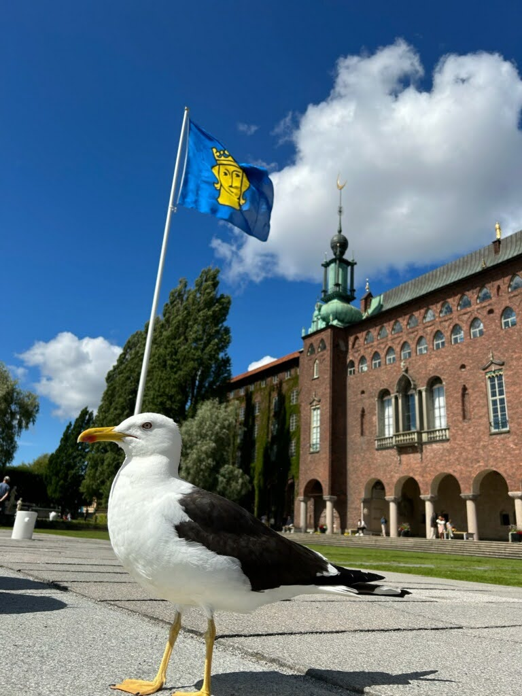
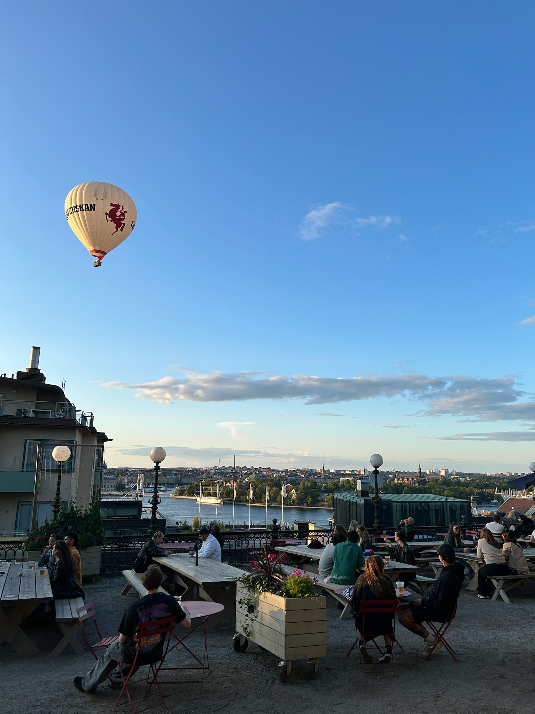
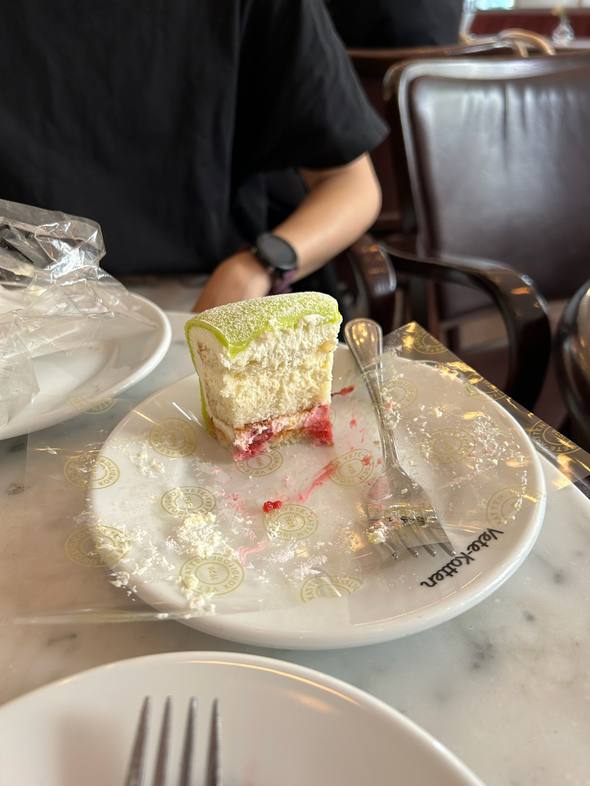
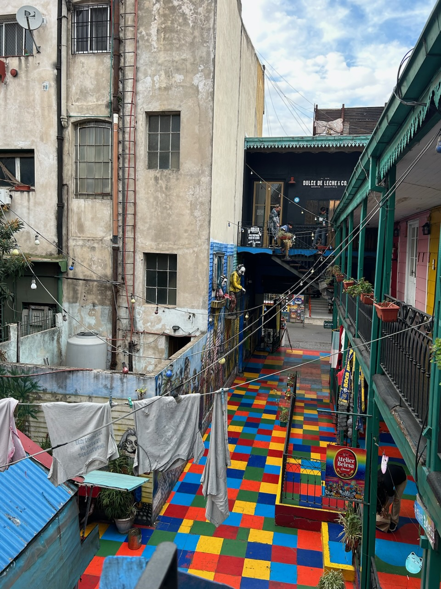
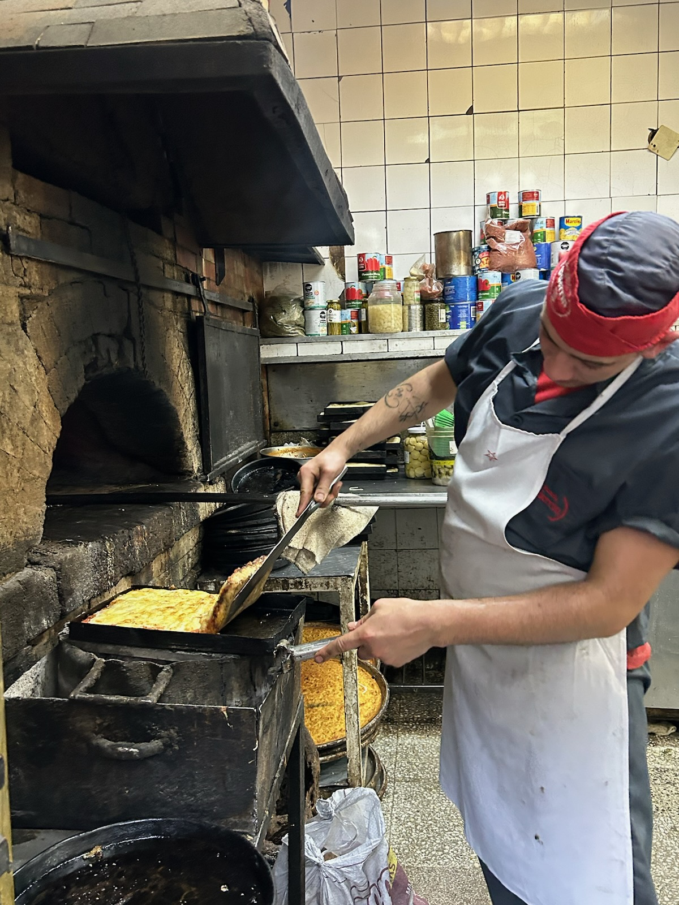
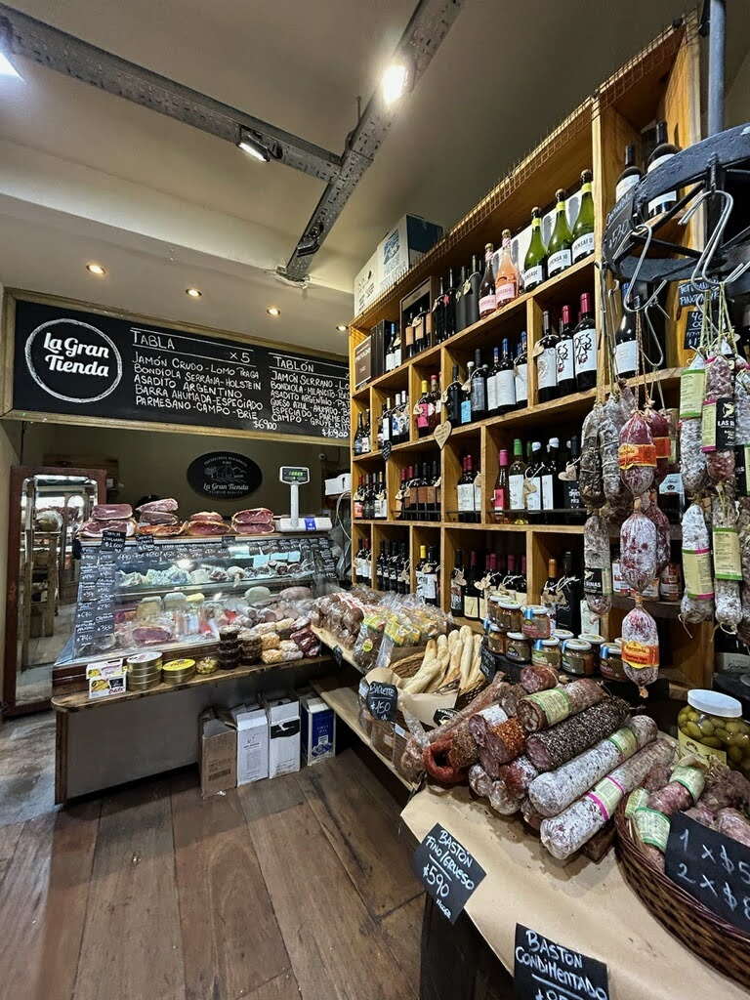

## Musings       
- [Wimbledon](#wimbledon)   
- [Stockholm](#stockholm)   
- [Buenos Aires](#buenos-aires)  
- [Beppu](#beppu)   
- [Books](#books)   
- [Albums](#albums)   

### Wimbledon   
<h2>(July, 2024)</h2> 
<ul style="list-style-type:none;">
I was looking up at the ceiling of my Putney hotel at 5AM thinking to myself, “man, am I really about to go line up for six hours at the crack of dawn to watch some tennis?” But I figured I better get out of the bed, considering I flew 4000 miles across the pond for this. 

Setting out from Putney to Wimbledon in the dark, I tried reassuring myself that getting up early and joining the <a href="https://www.wimbledon.com/pdf/The_Queue_Guide_2024.pdf">Wimbledon Queue</a> would be a worthwhile endeavor. What I didn’t realize at the time was that remarkably, The Queue would be just as memorable as the tennis itself. 

I had heard in passing that the British were good at queing - in fact, they even liked it (unfathomable stuff as an American). When I officially joined the line at 6:20AM as person number 6346, I immediately recognized that this was no ordinary line - nothing that I had experienced before. When I entered, a Wimbledon official line leader told me where exactly to go and sit down, another official holding a flag marked with the letter “Q” could be visible to signify the start of the queue, and ropes demarcated the snaking of the lines. No hassle, no confusion - just join the queue.  
   

  
   
  

    
   
As the sun rose, the conversations with my neighbors began and so did the fun. I introduced myself to the local Brits, Argentines, and Aussies that were queued nearby. Every ten minutes, one could hear the opening of a beer can, popping of champaign, or uncorking of wine. We spoke about which matches and players we were hoping to watch, how far we’ve traveled, and what to expect once on the grounds. We were the commoners who cared for tennis enough to wait six hours starting at dawn, and I was convinced that the wait ahead of us would unite us strangers. At one point when I looked at the expanse of the entire field of those who came to wait, I realized that I had never seen a group of people so happy to queue. I saw people drinking, laughing, playing cards, having a picnic, volleying a tennis ball. With each passing hour, my excitement and anticipation grew.  

Around the four and five hour mark, the long snaking line began to move towards the entrance. My mind began imagining what it would be like inside. The excitement in the queue was palpable, we were getting closer. At hour six, we finally approached the entrance to the grounds where the signage became more official. Smiling now, I went through the security checkpoint and took it all in - centre court, the draw board, the ornate decor, and the immensity of the prestine grounds. If you’re a tennis fan, it’s really worth checking out at least once in your life.  

The queue turned out to be a strikingly human experience - an organized pilgrimage and sherpherding of the well mannered common man into the hollowed grounds of Wimbledon. It is a celebration of sport and a valuable experience in itself. Sure, watching Ben Shelton’s 135mph serve go untouched and the ensuing chalk fly into the air was quite memorable, but so was the queue.   

</ul>  

### Stockholm  
<h2>(July, 2023)</h2> 
<ul style="list-style-type:none;">
I spent a week in Stockholm during the summertime - the time of year in Sweden when the days are long, the flowers are blooming, restaurant outdoor seating is plentiful, and Vitamin D supplements aren't necessary. The winters on the otherhand, I hear are miserable. Perhaps it is this dichotomy along with the brevity of the summer days that make the locals savor every last ray of the sun, glowing in the fresh Scandanavian air (I swear to you the Swedes glow differently in the sun).  
And honestly, they have every reason to be out there enjoying the quietly aesthetic city that is Stockholm. The smattering of colors, the cool breeze off the water, the mix of cars, boats, trains, kayaks, and bikes all traversing the city - none of it was 'in your face'. It all felt just-right and unforced. Similarly, my stay in Stockholm felt unforced, consisting of a healthy mix of the usual touristy attractions, exploring the city by foot, and eating the local cuisine.     

  
   
  

    
   

  <li>The Vasa Museum lives up to the hype and should not be missed. The museum commemorates a behemouth warship that sank shortly after its first departure. Despite the failed functionality of the boat, it remains a testament of labor and artistry. </li>  
  <li>I enjoyed bathing in the greenery and waterscape of each park and walking path we explored. Bellevue parken has a walking path where you may come across locals grilling in the firepits, kayakers, small lakeside restaurants that serve aperol spritz, and tennis being played on red clay courts. We opted to kick a ball around on one of the turf fields.  </li>  
  <li>Kayaking Stockholm provides a distinctive perspective of the architecture and city layout. I found myself looking at the scenery of Stockholm from my kayak and being surprised by the harmony of it all - the different modes of transit moving in unison, the colors on the buildings, the calm water, and how strangely quiet it was. No honking, no yelling, none of the cacophony that I associate with urban settings. </li>  
  <li>We explored Vaxholm for a day and it was the ideal quick and easy get away from the city center that we were looking for. If you find yourself over there, give in and buy a carton of strawberries. Strawberries, or jordgubbe (literal translation: 'earth-lads' ) hit different in Sweden. While we explored the more residential areas of Vaxholm, an older woman who lived in one of the lakeside houses waved us down and gave us her pleasantries from her massive picturesque terrace. I couldn't hear a word of she said, but the image of her waving while surrounded by her flowers in the blue sky and sun is my lasting memory of Vaxholm. </li>  
 
Ok so, I saved my best impression of Stockholm (and arguably the most important) for last.    
The pastries.   
The pastries in Stockholm kick so much ass.   
I cannot stress enough how fantastic the pastries were. I woke up excited every morning, since waking up meant that I was nearer to consuming yet another Swedish pastry for breakfast. Every bite of every pastry was utter enjoyment. You know that satisfaction of biting into your favorite food? That magical moment when all the flavors come in contact with your tongue? I felt that delight every damn morning in Stockholm. 
Kardemommeboller (cardamom buns), Kanelbulle (cinnamon roll), Hallongrotta (no idea what the American equivalent is???), Prinsesstårta (princess cake), you name it - didn't matter what it was and it didn't matter which cafe we ate at. It was all magic.   
I'll be back for the Kardemommeboller. 

</ul>  

### Buenos Aires    
<h2>(July, 2023)</h2> 
<ul style="list-style-type:none;">  

Every city has unwritten rules. When you understand these rules, the better you can exploit these rules, get more out of the city, and step through new doorways previously shut. Don't understand or don't play by the rules?    
Easy - You'll step in the shit.    
Most of us have unknowingly been the rule-makers all our lives. As citizens, locals, and community members, we are bestowed the right to create the standards that become the fabric in our respective neighborhoods. But, I was stripped of this power when I visited Buenos Aires. I lost it completely - and to be honest, it was really, really fun.    
I didn't think being humbled would be a state of mind that I desired, but my week in Buenos Aires changed that. I left for my trip on a whim, my only preparation being a few notes I saw on reddit posts. At first, I felt as though everything was happening so quick and if I didn't keep up, my ride to Argentine glory would leave me behind with only my bruised ego. But I eventually found my pace and learned to appreciate all that was unfolding in front of me.   
Luckily, my elementary Spanish sufficed for *most* interactions, as the mere fact that I could utter basic phrases seemed to please the locals. My spanish, in fact, was somehow sufficient enough for the slightly seedy cash exchange with a broker who worked nearby my hotel. What first seemed like an orderly game of poker between me and the broker quickly busted open into a full fledged tennis match of broken Spanish and el inglés chapurreado. Numbers that I for sure did not comprehend were served over to me and I returned with over zealous counteroffers. We went back and forth with rapid fire pace, neither willing to give an inch. Despite our spirited rallies, we amicably agreed on an exchange rate - a rate that to this day I do not know was worthy of my five-set effort. What I did know was that receiving my pesos meant receiving my lifeblood - Cash was King in Buenos Aires during my stay.    
This interaction turned out to be the perfect welcome. It was swift, unexpected, required me to be quick thinking, and most of all, I had fun doing it all while learning the rules. I can assure you, though, that not all my exchanges had outcomes as favorable as this. The steak that I thought I ordered medium came out thoroughly charred to the core, and in my first cafe, it took the waiter using hand gestures and miming to ask if I wanted sparkling or still water.    
Some of my most human and memorable exchanges occured with my cab drivers - they were all so gregarious and ready to teach me a lesson or two about Buenos Aires. Interestingly enough, the cab was the ideal space where I could speak Spanish one on one with a local and hear what they had to say about their country. I learned quite a bit about Argentine history, culture, and politics in my various rides.    

  
   
  

    
    
I loved the grittiness of Buenos Aires - there was constant movement and each neighborhood had its unique charm. It's a shame that I had to leave when my stride finally felt like it started to match that of the city and its citizens. Buenos Aires appeared to be in constant motion, but it wasn't a blur - it was a beautiful mosaic of parks, cafes, transit, murals, and people.    
One last thing about BsAs - there's dog shit all over the streets. Watch out for it, or else you'll get a shoe full. 

</ul>  

### Beppu   
<h2>(February, 2023)</h2> 
<ul style="list-style-type:none;">
Japanese ferry rides are often overlooked by locals and travelers alike. While trains provide the clean, punctual, and efficient experience of quintessential Japanese travel, the ferry ride offers another distinct way to journey across Japan that should not be missed.    
In February I boarded my first overnight Ferry with my father from Osaka bound for Beppu, a city known for relaxing and rejuvenating in its natural hot springs and seaside spas. Upon entering the ship, I was handed the keys to our quarters and directed towards the assortment of amenities onboard – the drink bar, the buffet dinner, the views from the deck, and an ofuro, among other things. This setting of unexpected elegance and variety was a pleasant surprise, and it eventually became an ideal place and point in time for reflection and repose.       

    

    

 
We took in the sunset from the deck while breathing in the salty, cool Kansai air. We ate a buffet style dinner full of fresh seafood and sipped on draft Asahi in the dining room. We washed off and gazed into the passing city scape from the ship’s rotenburo. What I found really cool was that each of these spaces was shared with many different kinds of travelers – the gregarious gaijin journeying to a Buddhist monk retreat, the three local obachans on their way to a weekend getaway, and the cross-country truckers ready for a night at home.    
Back in our quarters, we finished our drinks and sunk into a relaxed state for bed. Peeking out the window I saw only a few flickering lights in the darkness drifting away. The moving lights in the distance and the steady hum of the engine underneath my feet reminded me I was actually on a ship heading towards Beppu.     

   

    

 
As I let myself glide along with the water and passing city lights, I remembered a passage I had recently read by Bill Russel in which he recounts his first trip to Africa. During his trip, Russell remarked, “somewhere in Africa is my ancestral home. I came here because I am drawn here, like any man, drawn to seek the lands of my ancestors.” While traversing the islands of Japan on the water, Russell’s words rang true to me. My desire to connect to the lands and seas of my own ancestors felt more salient than ever. I was sure that my ancestors were calling me back. They were welcoming me home.  

</ul>   

### Books     
<h2> Best books I read in 2020 (December, 2020)</h2> 
<ul style="list-style-type:none;">  

<h2> The Lady Tasting Sea (Salsburg)</h2>     

The more I journey into the study of statistics, the more I see it as a philosophical science. Perhaps the rigorous endeavor of any subject results in using the subject’s laws to make sense of our reality. Even so, I thought I would write a few of the lasting impressions that this book and statistics as a whole – a science typically not seen in a philosophical light - leaves on my worldview.  
Statistics attempts to make sense of reality by assigning quantities such as proportions, risks, and probabilities to events. Underlying this process is how these events are generated. In statistical jargon, this is often termed the “data generating mechanism”. Salsburg provides a historical account of the science community’s evolving ideas on how the events in our world are generated. Two camps of thought are brought to light in this regard: The Deterministic and Random camps.  
A deterministic worldview, propelled by Newtonian physics in the nineteenth century, is centered by the idea that reality is governed by predetermined forces. Thus as science advances and the precision of measurements improves, we get closer to the true governing forces that rule reality (i.e. the gravitational constant). In this framework, randomness does not exist. Rather, science has not yet discovered the laws that govern our reality, and thus the assignment of what we do not understand as “random” is erroneous.  
Karl Pearson deviated from deterministic thought in the early twentieth century and conceived of the distribution function, claiming that statistical distributions describe the fundamental randomness of reality. Pearson spearheaded the “Random” camp, asserting that observable phenomena are a result of a bunch of random processes. The gravitational constant in this framework is not one specific value, but rather is derived from a distribution of gravitational constants. The gravitation constant we use, 6.67 × 10^-11, is the value that is most likely to be observed from all the experiments we have performed. 
Irrespective of whether one believes in randomness or determinism, modern sciences stand on the foundation of Pearson’s mathematical distribution functions – a fact that is often overlooked. Pearson’s groundwork led to the birth of maximum likelihood, hypothesis testing, and p-values (heavy lifting from Fisher), which stand as absolutes in modern science.  
It’s easy to get lost in the minutiae while studying statistics, but this book and Pearson appeal to re-evaluating concepts, equations, and formulas from a grander perspective. A once contrarian philosophy that our world is random rather than determined has led to the fruition of a scientific revolution and continued imprint in modern discovery.   

<h2> Convenience Store Woman (Murata)</h2>     

<BLOCKQUOTE><I>Until now, we’d always had meaningful worker-manager discussions: “It’s been hot lately, so the sales of chocolate desserts are down,” or “There’s a new block of flats down the road, so we’ve been getting more customers in the evening”… Now, however, it felt like he’d downgraded me from store worker to female of the human species.</I></BLOCKQUOTE>This passage from Murata was perfect - hilarious, sad, and a bit sobering. Murata’s efficacy lies in allowing the reader to simultaneously relate and collide with Miss Furukawa’s psyche. We cheer for her, are confused by her, laugh at her, and laugh with her. I grappled with all of these thoughts and then some when reading this passage and the rest of Murata’s novel.   
   
<h2> Embracing Defeat (Dower)</h2>     
The process of the post-WWII democratization, demilitarization, and liberation of the collective Japanese mind from a power-hungry empire was, to say the least, complex. Inevitably, the undertaking of such a sweeping process comes with its fair share of consequences. Dower’s succinctly illuminates the lasting effects of these consequences: 
<BLOCKQUOTE><I>“For all their talk of democracy, the conquerors worked hard to engineer consensus; and on many critical issues, they made clear that the better part of political wisdom was silence and conformism. So well did they succeed in reinforcing this consciousness that after they left, and time passed, many non-Japanese including Americans came to regard such attitudes as peculiarly Japanese.”</I></BLOCKQUOTE>What an insightful passage. While it is true that there existed a conception that Japanese were silent and conformist pre-occupation, the result of occupation-led censorship and control perpetuated and more importantly made these traits truly tangible – especially to the rest of the world. Perhaps most mind racking is the stark contrast of the legacies left behind of these actions. The conquerors brought democracy and order swiftly without making too much noise. Yet they left behind some of today’s most quintessential traits of the Japanese.   
</ul>
    
### Albums     
<h2>My favorite albums of 2020 (December, 2020)</h2> 
<ul> 
  <li>Circles (Mac Miller) </li>
  <li>Un Canto Por México, Vol. 1 (Natalia LaFourcade) </li>
  <li>The New Abnormal (The Strokes) </li>
</ul>   
  
*Notable Mentions*: RTJ4 (Run the Jewels), Future Nostalgia (Dua Lipa)  
